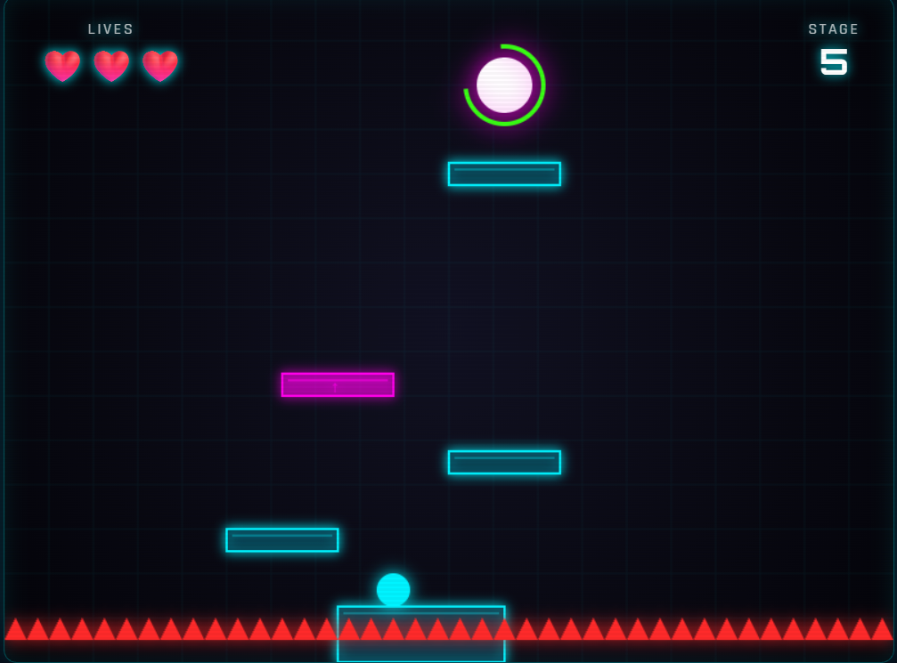

# Neon Bounce

- [English Version](#english-version)
- [Versi Bahasa Indonesia](#versi-bahasa-indonesia)

---

## English Version

A vibrant, retro-futuristic arcade/platformer game built using vanilla **HTML5 Canvas**, **CSS3**, and **JavaScript**. Featuring a responsive overlays, and interactive audio.
<a href="https://dickyzibran.github.io/bounce/" target="_blank">
  Click here to view
</a>



### How to Play

1. **Main Objective**: Guide your character through obstacles and reach the **portal** at the end of each sector to advance to the next stage.
2. **Desktop Controls**:
   - Move Left: `Left Arrow` or `A`
   - Move Right: `Right Arrow` or `D`
   - Jump: `Up Arrow`, `W`, or `Spacebar` (supports single press and holding keys safely)
3. **Mobile Controls**:
   - Use `◀` (Left) and `▶` (Right) virtual buttons to walk.
   - Use `▲` (Up) action button to jump.
4. **God Mode Cheat**:
   - Type the word `kebal` on your keyboard during a game to become invulnerable.
   - Type the word `normal` to turn off invulnerability.

### Tech Stack

- **HTML5**: Uses `<canvas>` for dynamic rendering and clean semantic tags for accessibility (ARIA structure).
- **CSS3**: Implements CSS Variables, Flexbox/Grid layouts, `@keyframes` animations, glassmorphism filters, perspective transformations, and animated CRT scanlines.
- **JavaScript (ES6+)**: Custom frame-by-frame game loop, modern event handlers (keyboard & touch), local storage management, and Web Audio API oscillators for sound synthesis.
- **Google Fonts**: Futurist fonts `Orbitron` and `Rajdhani`.

### How to Run the Game

This game is built purely using front-end technologies with no compilation/build steps needed.

#### Option 1: Open Directly (Easiest)
1. Download or clone this repository to your computer.
2. Double-click the `index.html` file to open it directly in any modern web browser.

#### Option 2: Using a Local Server (Recommended for audio stability)
If you face audio loading issues due to browser security policies (*CORS*), you can serve the game locally:
- Use the **Live Server** extension in VS Code.
- Or run the following command in your terminal if you have Node.js installed:
  ```bash
  # Run a simple static server inside the project directory
  npx serve .
  ```

---

## Versi Bahasa Indonesia

Game arkade/platformer retro-futuristik menarik yang dibuat menggunakan **HTML5 Canvas**, **CSS3**, dan **JavaScript** murni. *overlay* UI responsif, dan audio interaktif.

### Cara Bermain

1. **Tujuan Utama**: Kendalikan karakter Anda untuk melewati rintangan dan mencapai **portal** di setiap sektor guna melaju ke stage berikutnya.
2. **Kontrol Desktop**:
   - Bergerak Kiri: `Tombol Panah Kiri` atau `A`
   - Bergerak Kanan: `Tombol Panah Kanan` atau `D`
   - Melompat: `Tombol Panah Atas`, `W`, atau `Spacebar` (mencegah lompatan beruntun tak disengaja)
3. **Kontrol Mobile**:
   - Gunakan tombol D-pad virtual `◀` (Kiri) dan `▶` (Kanan) untuk berjalan.
   - Gunakan tombol aksi `▲` (Atas) untuk melompat.
4. **Cheat Kebal (God Mode)**:
   - Ketik kata `kebal` pada keyboard Anda saat permainan berlangsung untuk menjadi kebal dari rintangan.
   - Ketik kata `normal` untuk mematikan mode kebal.

### Teknologi yang Digunakan

- **HTML5**: Menggunakan elemen `<canvas>` untuk merender grafis secara dinamis dan tag semantik HTML5 yang ramah aksesibilitas (struktur ARIA).
- **CSS3**: Pemanfaatan CSS Variables, tata letak Flexbox/Grid, animasi `@keyframes`, filter transparan (*glassmorphism*), transformasi perspektif, dan CRT filter.
- **JavaScript (ES6+)**: Logika game loop berbasis *frame-by-frame*, penanganan input event listener (keyboard & touch), manajemen local storage, dan generator suara sintetis Web Audio API.
- **Google Fonts**: Menggunakan font futuristik `Orbitron` dan `Rajdhani`.

### Cara Menjalankan Game

Game ini dibuat murni menggunakan teknologi *front-end* standar tanpa perlu kompilasi/build.

#### Metode 1: Buka Langsung (Paling Mudah)
1. Unduh atau clone repositori ini ke komputer Anda.
2. Klik dua kali pada file `index.html` untuk membukanya langsung di peramban (browser) favorit Anda.

#### Metode 2: Menggunakan Local Server (Direkomendasikan untuk stabilitas audio)
Jika ada kendala pemuatan aset suara karena kebijakan keamanan browser (*CORS*), Anda bisa menjalankannya lewat server lokal:
- Menggunakan ekstensi **Live Server** di VS Code.
- Atau jalankan perintah berikut di terminal jika Node.js sudah terinstal:
  ```bash
  # Menjalankan server statis sederhana di folder project
  npx serve .
  ```

### Lisensi
Proyek ini dibuat untuk tujuan pembelajaran dan hiburan. Bebas dikembangkan kembali atau dimodifikasi sesuai kreativitas Anda!
